<!-- ============================================================
     Profile README · SAGARRAMBADE21
     Theme: XO / OpenClaw  ·  banner: ./assets/xo-hero.svg
     ============================================================ -->

---

## 🧠 About

AI Research Intern at XO, working on agent harnesses: the control loop, tool routing, context management, and sandboxed environments that make an agent reliable in production. I build the backend behind it (Composio for integrations, Playwright for browser automation, SendGrid for delivery) and run agents in isolated sandboxes with Coder. I've worked hands-on with runtimes like OpenClaw and Hermes, and building at a startup showed me how agents behave outside a demo. I care most about harness design and what makes an agent genuinely autonomous.

---

## 🛠️ Tech stack

---

## 📬 Contact

<!-- email from your GitHub profile — change above if it's different -->

<!-- TODO: replace https://www.linkedin.com/in/your-handle with your real LinkedIn URL -->

