<!-- ============================================================
     Profile README · SAGARRAMBADE21
     banner:     ./assets/hero.svg     (love.jpg still + name/tagline overlay, base64-embedded)
     background: ./assets/profile.svg  (Spider-Man wallpaper baked in behind the content)
     avatar:     ./assets/avatar-swing.svg (auto-swings) -> click reveals ./assets/love-story.svg
                 (Gwen webs Miles, heart pops, "Perfect" lyric) + a YouTube play link below it
     ============================================================ -->

---

---

  

   
  
   
  

🕸️ psst — click the Spideys (then hit ▶ Play)

